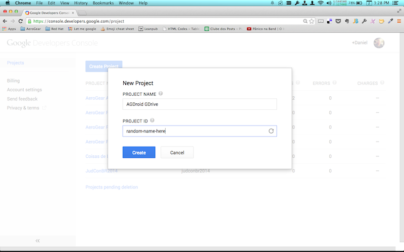
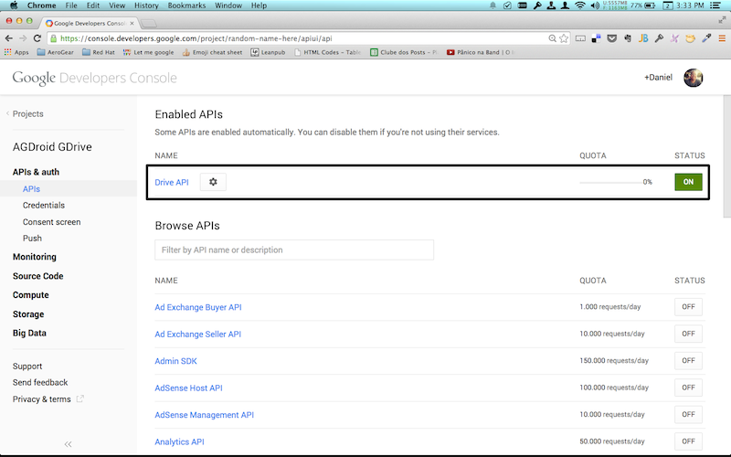
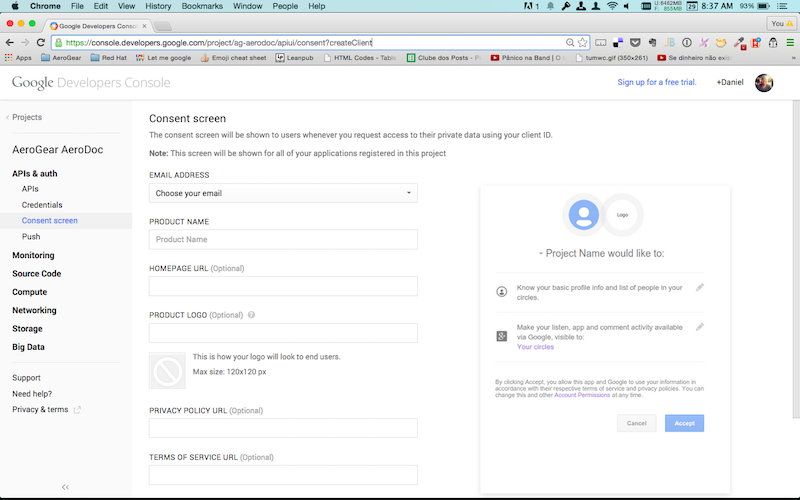
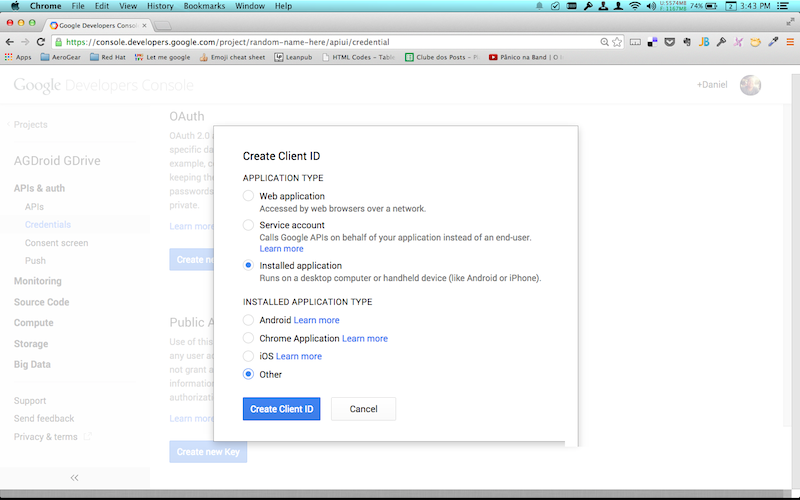
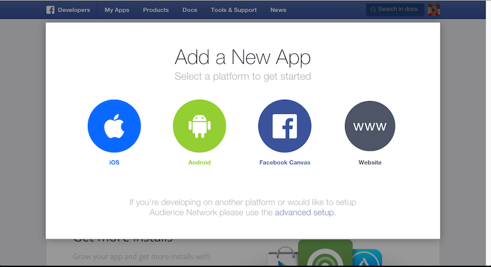
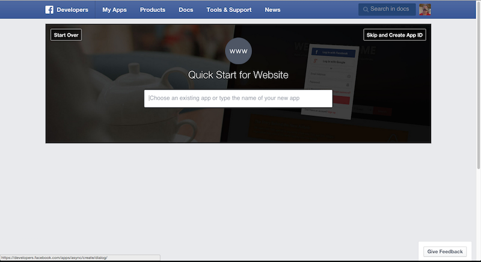
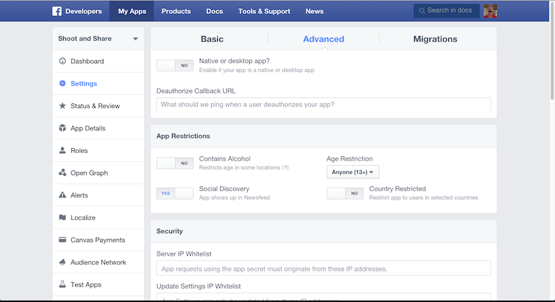

# Shoot and Share: Basic Mobile Application showing AeroGear Pipe and Authorization with multiple service providers
---------
Authors: Summers Pittman (secondsun) - Daniel Passos (dpassos)  
Level: Advanced  
Technologies: Java, Android, Google, Facebook, KeyCloak  
Summary: And example of interacting with several modern web services.  
Target Product: -     
Product Versions: -     
Source: https://github.com/aerogear/aerogear-android-cookbook/tree/master/ShootAndShare   

## What is it?

The ```Shoot and Share``` project demonstrates how to authenticate with Google, KeyCloak, and Facebook as well as how to upload pictures to Google Drive, your Facebook Wall, or a KeyCloak protected web service.

This application also has an [iOS port](https://github.com/aerogear/aerogear-ios-cookbook/tree/master/Shoot) and a [companion Server](https://github.com/aerogear/aerogear-backend-cookbook/tree/master/Shoot) to host keycloak.

## How do I run it?

### 0. System Requirements

* [Java 7](http://www.oracle.com/technetwork/java/javase/downloads/index.html)
* [Gradle 2.2.1](http://www.gradle.org/)
* Latest [Android SDK](https://developer.android.com/sdk/index.html) and [Platform version 21](http://developer.android.com/tools/revisions/platforms.html)

### 1. Service Requirements

#### Google Account Setup

First, you must authenticate with Google. You will need a Google Account for this. Now open the [Google Console](http://console.developer.google.com).

If you haven't created a project, click "Create Project" and give the new project a name:



Now you need to enable the Drive API. To do that, navigate to APIs & auth > APIs and scroll down to the Drive API item, which you need to turn on:



Now you need create new credentials to access your Drive accounts from the app. Go to APIs & auth > Credentials and inside OAuth area click the blue `Create new Client ID` button. 


You will need to create a _consent screen_. Click the blue `Configure consent screen`



Afterwards, click save and you will return to the Client ID. Select `Installed application` and `Other`:



On the last screen we finally get to see the actual value of the generated `client id`, `secret id` and `redirect uris`, which you will use later:


#### Facebook Account Setup

First you must have a Facebook account.  Now open the [Facebook Developers](https://developers.facebook.com/) page and select 'Apps' -> 'Add a New App'


Click on 'advanced setup'



Setup a Display Name and Namespace and select a category, then click create app ID



Fill out the captcha

You are now on the Dashboard view.  Make a note of your 'App ID' and 'App Secret'. You are now on the Dashboard view.  Make a note of your 'App ID' and 'App Secret'


Select 'Settings' from the sidebar and then the 'Advanced' tab


Scroll to Security and enable 'Embedded browser OAuth Login' and make 'https://localhost/' your redirectURI



Now save your changes and Facebook is ready to go.

#### Keycloak and Shoot Server Setup

Please refer to [aerogear-backend-cookbook shoot recipe](https://github.com/aerogear/aerogear-backend-cookbook/tree/master/Shoot).

### 2. Application Setup

#### Enable Google Account

In the class `GooglePlusHelper` there are two fields `AUTHZ_CLIENT_ID` and `AUTHZ_CLIENT_SECRET`.  Use the values you received from the Google console during 'Google Account Setup'

#### Enable Facebook Account

In the class `FacebookHelper` there are two fields `AUTHZ_CLIENT_ID` and `AUTHZ_CLIENT_SECRET`.  Use the values for 'App ID' and 'App Secret' you received from Facebook during 'Facebook Account Setup'

#### Enable Shoot Server Integration

In the class `KeycloakHelper` edit the field `SHOOT_SERVER_URL` to refer to the address of the server you are running the shoot server on.  If this is the host machine of the emulator you can use 'http://10.0.2.2:8080'

### 3. Build Application

```shell
$ cd /path/to/app
$ gradle clean build
```

### 4. Test Application

To deploy, run and debug the application on an Android device attached to your system, on the command line enter the following:

5.1) Install generated apk to device

```shell
$ cd /path/to/app
$ gradle installDebug
```

5.2) Open app on device
Application output is displayed in the command line window.

## How does it work?

`CameraActivity` is responsible for taking pictures and saving them locally.  After you take a picture an intent will launch `PhotoActivity`.

`PhotoActivity` is the sharing UI.  In this class the calls are made to connect to the remote services using helper classes and uploads photos using an intent to start a background service.

`GooglePlusHelper`, `FacebookHelper`, and `KeycloakHelper` are utility classes which connect to remote services using `aerogear-android-authz` and upload photos to these services using `aerogear-android-pipe`.

`UploadService` performs the upload in the background so the UI is not blocked.
